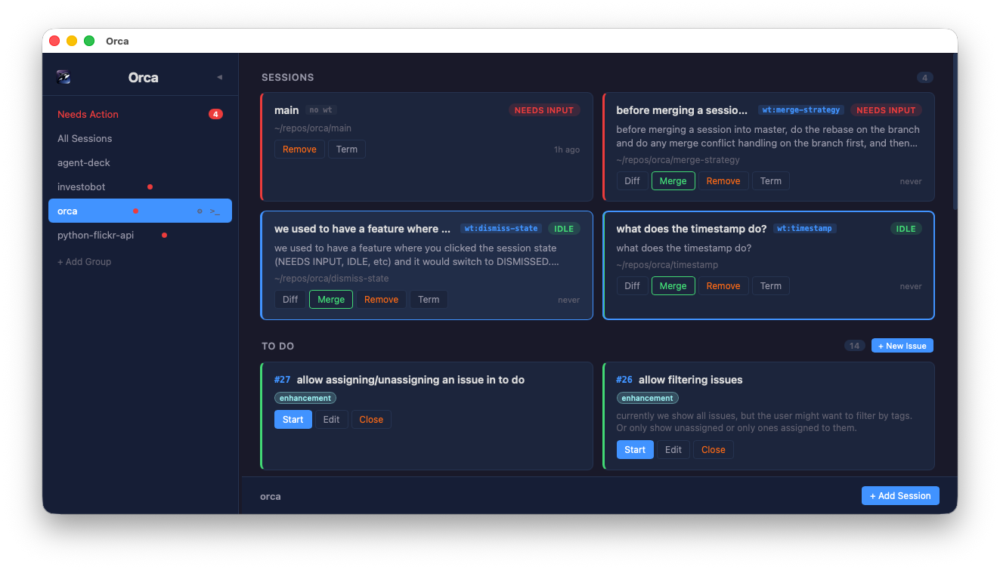

<p align="center">
  
</p>

<h1 align="center">Orca</h1>

<p align="center">
A desktop app for managing parallel <a href="https://claude.ai/claude-code">Claude Code</a> sessions across repos and git worktrees.
</p>

---

Orca allows you to have many parallel Claude Code sessions running at the same time, while giving you a view into what each one is doing, which ones need your attention, and one-click access to handy utils like a diff view and terminals. It is built on top of [agent-deck](https://github.com/nichochar/agent-deck).

<p align="center">
  
</p>

## Status

This app is very much in development mode and is crafted for my workflow, but I'd wager it should work for most people.

## Features

- **Attention indicators** — Color-coded status for each session: needs input (red), error (orange), running (blue), idle (green), stale (gray)
- **"Needs Action" view** — A single view of every session waiting for you across all repos
- **Integrated terminal** — Full xterm.js terminal embedded right in the app
- **Worktree management** — Create, diff, rebase, and merge git worktrees from session cards. Supports custom worktree scripts for monorepos with sparse checkouts
- **Keyboard-driven** — Navigate sessions (`j`/`k`), switch groups (`0`-`9`), search (`/`), and more. Press `?` for the full list
- **Session organization** — Group sessions by repo/project, move between groups, rename, and filter

## Prerequisites

Orca requires the following tools to be installed:

- [agent-deck](https://github.com/nichochar/agent-deck) — manages the underlying sessions
- [tmux](https://github.com/tmux/tmux) — terminal multiplexing
- [git](https://git-scm.com/) — worktree operations
- [Claude Code](https://claude.ai/claude-code) — the AI coding assistant

## Installation

You can download the .dmg [here](releases) or build Orca yourself.

## Building

### Requirements

- [Node.js](https://nodejs.org/) (for the frontend)
- [Rust](https://rustup.rs/) (for the Tauri backend)

### Build

```bash
git clone https://github.com/beaufour/orca.git
cd orca
npm install
npx tauri build
```

The built application will be in `src-tauri/target/release/`.

For development:

```bash
npx tauri dev
```
