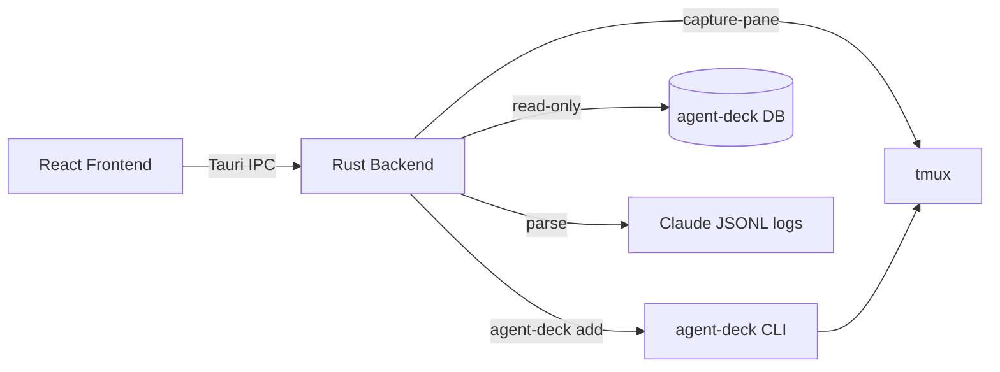
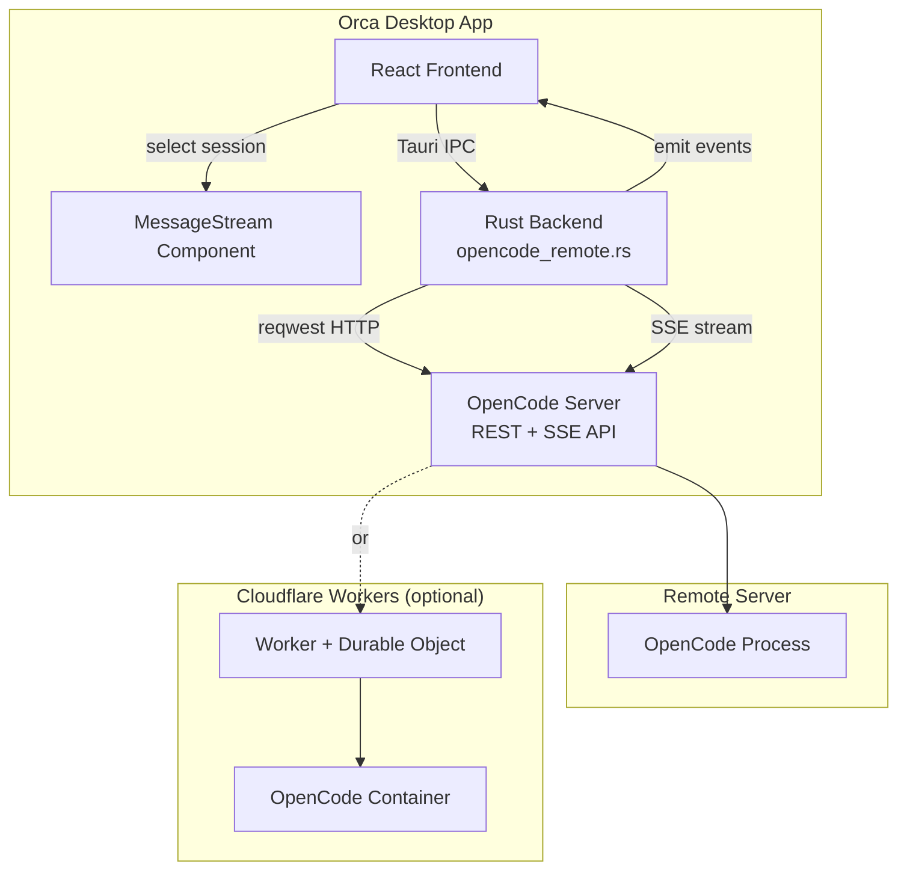
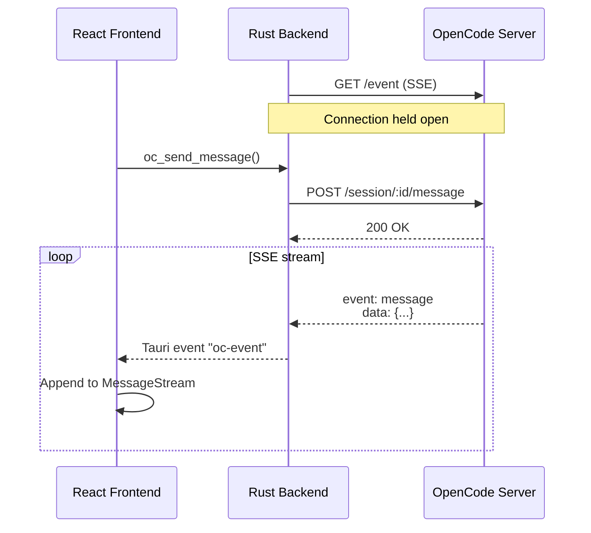

# Orca Backends

Orca supports two session backends. Each group is configured with exactly one backend. Existing groups default to `local`.

## Local Backend (agent-deck + tmux)

The default backend. Sessions run locally via agent-deck and tmux.

**Supports**: Claude Code, OpenCode, Shell sessions

**How it works**:

1. User creates a session in the Orca UI
2. Orca calls `agent-deck add -c <tool>` to create the session
3. Agent-deck spawns a tmux session running the selected tool
4. Orca reads agent-deck's SQLite DB for session state (polled every 3s)
5. Orca parses Claude Code JSONL logs for summaries and attention status
6. Terminal view embeds tmux output via a PTY bridge

**Configuration**: None required beyond having agent-deck and tmux installed.

**Data flow**:



## OpenCode Remote Backend (HTTP + SSE)

Connects to a remote OpenCode server over HTTP. Sessions run on the server, not locally.

**Supports**: OpenCode sessions only (no tool picker shown)

**How it works**:

1. User configures a group with `opencode-remote` backend, providing a server URL and password
2. Orca's Rust backend makes HTTP REST calls to the OpenCode server
3. Live updates stream via Server-Sent Events (SSE)
4. The frontend renders a chat-style `MessageStream` view instead of the terminal

**Configuration** (per group, in Group Settings or at creation):

| Field      | Description                                 |
| ---------- | ------------------------------------------- |
| Server URL | Base URL of the OpenCode server             |
| Password   | Password for Basic auth (`opencode:<pass>`) |

**API endpoints used**:

| Action              | Method   | Endpoint                            |
| ------------------- | -------- | ----------------------------------- |
| List sessions       | `GET`    | `/session`                          |
| Create session      | `POST`   | `/session`                          |
| Delete session      | `DELETE` | `/session/:id`                      |
| Send message        | `POST`   | `/session/:id/message`              |
| Get messages        | `GET`    | `/session/:id/message`              |
| Respond to approval | `POST`   | `/session/:id/permissions/:pid`     |
| Subscribe to events | `GET`    | `/event` (SSE, `text/event-stream`) |

### Architecture



### SSE Event Flow



## Choosing a Backend

| Feature           | Local                      | OpenCode Remote       |
| ----------------- | -------------------------- | --------------------- |
| Session types     | Claude, OpenCode, Shell    | OpenCode only         |
| Runs where        | Your machine               | Remote server         |
| Terminal view     | Full tmux embed            | Chat-style messages   |
| Git worktrees     | Supported                  | Not applicable        |
| JSONL log parsing | Yes (summaries, attention) | No (uses SSE events)  |
| Requires          | agent-deck, tmux           | Server URL + password |

## Implementation Details

### Rust modules

- **`agentdeck.rs`** — Local backend: reads agent-deck DB, creates sessions via CLI
- **`opencode_remote.rs`** — Remote backend: HTTP client (reqwest), SSE streaming, 7 Tauri commands (`oc_list_sessions`, `oc_create_session`, `oc_delete_session`, `oc_send_message`, `oc_get_messages`, `oc_respond_to_permission`, `oc_subscribe_events`)

### Frontend routing

`App.tsx` checks `effectiveGroup.backend` to decide what to render:

- **`local`** → `TerminalView` (xterm.js + PTY bridge)
- **`opencode-remote`** → `MessageStream` (chat UI + SSE events)

`AddSessionBar` hides the tool picker and worktree options for remote groups since they only support OpenCode sessions without local worktrees.

### Database schema

Backend settings are stored in Orca's own DB (`orca.db`), not agent-deck's:

```sql
-- Added to group_settings table
backend         TEXT NOT NULL DEFAULT 'local'   -- "local" or "opencode-remote"
server_url      TEXT                            -- OpenCode server URL
server_password TEXT                            -- Basic auth password

-- New table for remote session metadata
CREATE TABLE remote_sessions (
    id              TEXT PRIMARY KEY,
    group_path      TEXT NOT NULL,
    title           TEXT NOT NULL,
    server_url      TEXT NOT NULL,
    status          TEXT DEFAULT 'idle',
    summary         TEXT,
    created_at      INTEGER,
    last_accessed   INTEGER,
    sort_order      INTEGER DEFAULT 0
);
```

Columns are added via migration (`ensure_backend_columns()`) so existing databases upgrade seamlessly.
